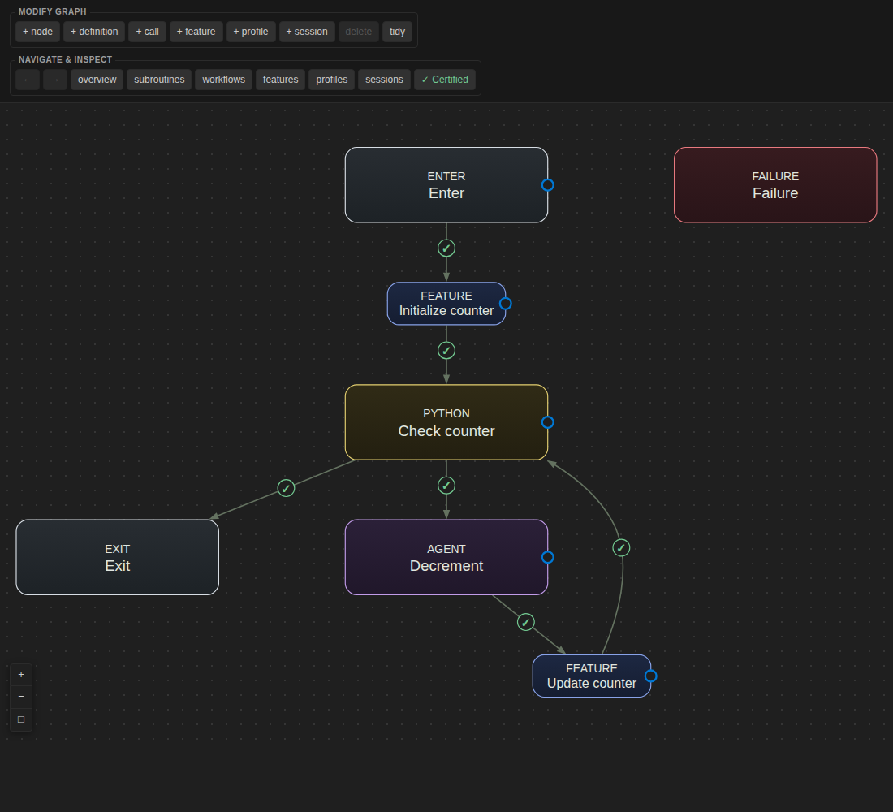

# Verdog for VS Code

Build agent workflows as graphs, implement their steps in Python, and run them locally.
Keep your workflow source and prompts in your own Git repository.

**[Website and documentation](https://drexlerd.github.io/verdog-website/)** ·
[Get started](https://drexlerd.github.io/verdog-website/getting-started.html) ·
[Try the running example](https://drexlerd.github.io/verdog-website/running-example.html)

[](https://drexlerd.github.io/verdog-website/running-example.html)

*Countdown: an agent proposes the next integer, Python validates it, and a decreasing
counter controls the loop.*

## Why workflows?

Workflows make proposal, verification, feedback, and revision explicit: an agent
proposes a result, your Python checks test it against your criteria, and failures
guide the next revision. Verdog lets you inspect and reuse that cycle. Read
[Why Verdog?](https://drexlerd.github.io/verdog-website/why-verdog.html) for the
motivation and limits.

## What you can do

- **Compose workflows visually.** Connect agent calls, Python steps, and reusable
  subroutines. Add conditions and effects to express how execution progresses.
- **Work beside your code.** Navigate from the canvas to Python implementations.
  Edit your prompts alongside them, and edit `project.json` with completion and undo.
- **Check before running.** Validate graph connections and Python types, and see
  diagnostics in the Problems panel.
- **Terminating workflows.** Certify termination using declared feature conditions
  and effects, as in the [running example](https://drexlerd.github.io/verdog-website/running-example.html).
  Certification assumes that individual steps terminate and respect those declarations.
- **Run and recover.** Execute locally, inspect outputs and logs in the Runs view, resume
  interrupted runs, restart a run, or fork from a saved checkpoint.
- **Share and reuse.** Browse published workflows, inspect their source, and import
  releases pinned to Git commits. Publish workflows from your own repository.

## Get started

Requires **VS Code 1.106+**, **Python 3.12+**, Git, and **verdog-cli 0.1.2+**
from [PyPI](https://pypi.org/project/verdog-cli/).

Install the CLI with [uv](https://docs.astral.sh/uv/getting-started/installation/):

```sh
uv tool install verdog-cli
verdog --help
```

For an existing installation, run `uv tool upgrade verdog-cli`. CLI 0.1.2 or newer
is required for lightweight run monitoring.

Install **Verdog** from VS Code's Extensions view, then:

1. Run **Verdog: New Project** from the Command Palette, or open an existing project
   containing `project.json`.
2. Run `verdog sync` in the project's terminal to prepare its Python environments.
3. Use **Verdog: Show Canvas**, **Verdog: Check**, and **Verdog: Run Workflow** to edit,
   check, and run. The initial blank workflow succeeds without an agent request.

A successful check in the editor or terminal remains current across reloads until
its source files change. Unsaved source edits also mark the canvas as unchecked.

For a complete agent workflow, follow the
[Countdown walkthrough](https://drexlerd.github.io/verdog-website/running-example.html).
Agent nodes need the provider tools and authentication selected by their
[profile](https://drexlerd.github.io/verdog-website/profile.html).

### Run monitoring

The Runs view reads run headers and the latest complete line of `trace.log`.
While visible, it checks running workflows every five seconds using their
existing execution locks. It does not scan checkpoint histories or artifact
inventories. Resume and fork inspect checkpoints only after you select a run.

The extension excludes `**/.verdog/**` from recursive file watching by default,
while watching run metadata and traces nonrecursively. Your
`files.watcherExclude` overrides remain in effect. Custom output directories
outside `.verdog` may need their own watcher exclusion if they are inside an
open workspace. If the CLI does not support lightweight monitoring, upgrade
it with `uv tool upgrade verdog-cli`; no full-history polling fallback is used.

## Service, sign-in, and privacy

Workflow execution is local. Generation and structural analysis use the hosted backend;
no backend installation or GitHub sign-in is required for compiler operations.
Catalogue operations use VS Code's built-in GitHub sign-in. Git cloning uses your Git
credentials separately.

**In trusted workspaces, opening or refreshing a graph sends project manifests for
analysis. Structural canvas edits, New Project, and catalogue imports send declared
project files for generation; Check and Rename also send declared project files.**
Restricted Mode and source-only catalogue previews disable automatic analysis. Running a workflow executes its code locally
and may contact its configured agent provider. See the [privacy policy](PRIVACY.md).

<details>
<summary>Backend and CLI configuration</summary>

The default backend is `https://157.180.79.112`. To use another deployment, set
`verdog.backendOrigin` in **User Settings** to its origin, without `/api/v1`.
HTTPS is required except for loopback addresses such as `http://127.0.0.1:18765`.
Workspace settings and project files cannot choose where sign-in tokens are sent.

GitHub sign-in uses VS Code's built-in provider and defaults to `read:user`, which
does not grant private repository access. To include private repositories, run
**Verdog: Authorize Private Repository Access**. The confirmation names your backend
and explains GitHub's broad `repo` scope, including read and write repository access,
before the token is sent there. No GitHub App registration or installation is needed.
Changing the backend or account requires a new private-access confirmation.

**Verdog: Use Public Catalogue Access** returns to `read:user`; it does not revoke
GitHub permissions shared with other extensions. The configured backend exchanges the
GitHub token for a Verdog session in VS Code SecretStorage, bound to the backend,
account, and access mode. Workspace settings cannot select private access.

If the CLI is not on your `PATH`, set `verdog.command` to an argument array. An
executable path containing spaces must be one array item. Catalogue browsing and source
inspection use only the user-level command and launch it outside the publisher checkout.

</details>

## Catalogue inspection

**Inspect** fetches the exact source and pinned repositories, then verifies their published
metadata. It does not install dependencies, select a Python interpreter, type-check, analyze,
or run the workflow. Import a verified release into your project, then synchronize its
Python environment and run it from that project's trusted window. A preview offers
**Open Target Project** after importing.

Preview source is cached separately from each originating project's temporary workspace.
Use **Verdog: Manage Catalogue Cache** to remove cached inspections.

## Development and releases

[Source and build inputs](SOURCE.md) · [Code quality guide](CODE_QUALITY.md)

<details>
<summary>Build, test, and package</summary>

Use Node.js 22 or newer (`nvm use` if available):

```sh
npm ci
npm run check
npm test
npm run package
```

Install the resulting `.vsix` with **Extensions: Install from VSIX…**.
Packaging type-checks and builds the extension first. To open a development window:

```sh
npm run build
code --extensionDevelopmentPath=. /path/to/project
```

For development previews, prepare `../verdog-cli/.venv` using the
[CLI development instructions](https://github.com/verdog-ai/verdog-cli#development).
Use the paired local-package installation while the matching runtime is unpublished.

`npm test` needs no sibling repositories. With `../verdog-cli` and
`../verdog-runtime` checked out, `npm run test:integration` checks the run-history
contract against the CLI and runtime producers. CI and release packaging also run this
check against the published CLI and its resolved runtime dependency, using their
matching release tags. Each run records the exact tags and commit SHAs in the
`run-history-contract-refs` artifact. This checks source/schema parity, not live
backend compatibility.
The extension host lives in `src/`, platform-neutral graph and editing logic in `model/`,
and the canvas and catalogue webviews in `webview/`.

</details>

<details>
<summary>Publish a release</summary>

Pushing a `v<version>` tag runs [release.yml](.github/workflows/release.yml): tests,
type checking, packaging, a public GitHub Release containing the VSIX and matching source,
then Marketplace publication of **that same VSIX** under publisher `verdog`.
The tag must match the version in `package.json`; update `package-lock.json` with it.
README links in the package are pinned to the release tag.

One-time Marketplace setup:

1. Create a Microsoft Entra publishing identity, following the
   [Marketplace authentication guide](https://code.visualstudio.com/api/working-with-extensions/publishing-extension#secure-automated-publishing-to-visual-studio-marketplace).
2. Create a GitHub environment named `marketplace` in this repository, allowing deployment
   from tags matching `v*`. Set its variables `AZURE_CLIENT_ID` and `AZURE_TENANT_ID`
   to the publishing identity's application/client ID and tenant ID.
3. Configure the identity's
   [GitHub federated credential](https://docs.github.com/en/actions/how-tos/secure-your-work/security-harden-deployments/oidc-in-azure):
   issuer `https://token.actions.githubusercontent.com`, audience `api://AzureADTokenExchange`,
   subject `repo:verdog-ai@319109192/verdog-vscode@1387501038:environment:marketplace`.
   This repository uses GitHub's [immutable subject format](https://docs.github.com/en/actions/reference/security/oidc#immutable-subject-claims).
   If its OIDC settings are customized, use the exact `subject claim` printed by the
   authentication step instead. No stored PAT or client secret is required.
4. On the first tag run, copy the ID printed by **Show Marketplace identity**. In
   [publisher management](https://marketplace.visualstudio.com/manage/publishers/verdog),
   open **Members**, add that ID, and grant **Contributor**. This is the publishing
   identity's Marketplace profile ID, not its Entra application ID or your personal ID.
   Until it is authorized, **Publish existing VSIX** will fail; authorize the identity
   and select **Re-run failed jobs**.

Commit and push the release changes, then push a new `v<version>` tag matching
`package.json`. If Marketplace authentication fails, configure it and select **Re-run failed jobs**: the public GitHub Release remains
available and the publishing job reuses the packaged artifact. An already published
Marketplace version is skipped on retry. Nothing is uploaded to Marketplace until
its identity has been configured and authorized.

The [publishing constraints](https://code.visualstudio.com/api/working-with-extensions/publishing-extension#publishing-extensions)
apply to the Marketplace icon, badges, and README/CHANGELOG images. The icon is a PNG;
SVGs used by VS Code's view containers are permitted. Packaging runs `vsce`'s validation.

</details>

## License

Verdog's extension code is licensed under **AGPL-3.0-only** ([LICENSE](LICENSE)), with
an [additional permission for linking with Graphviz](LICENSE-EXCEPTION). That permission
applies to Verdog's code; it does not change Graphviz's or other components' licenses.
Bundled third-party licenses and notices are included in the VSIX at
`dist/THIRD_PARTY_NOTICES.txt`. Matching source archives are provided with the
[releases](https://github.com/verdog-ai/verdog-vscode/releases); see [SOURCE.md](SOURCE.md).
